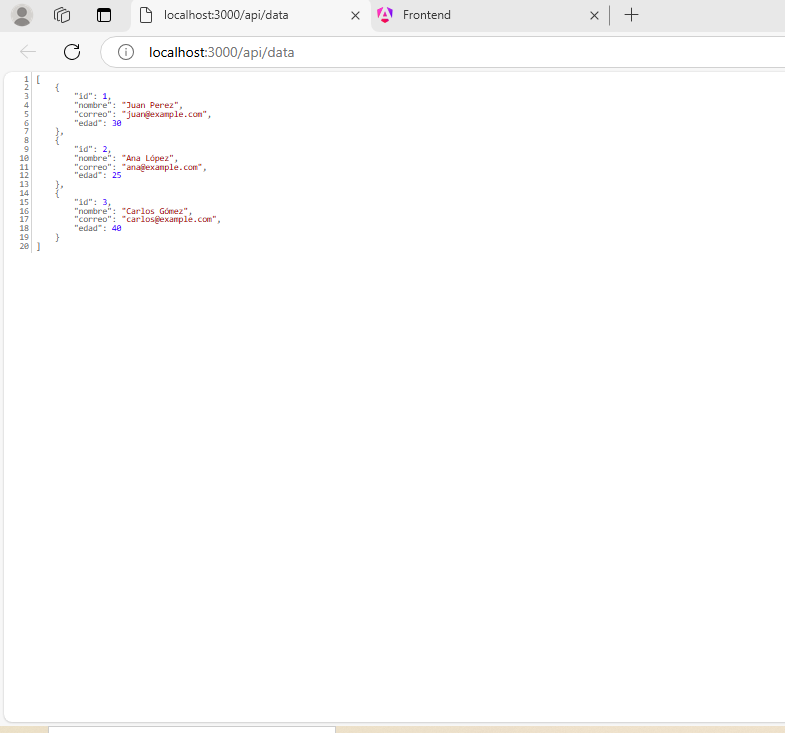

#  🌐  Microservicio y Frontend Angular  🚀 

- Descripción:Este proyecto consiste en un microservicio construido en Node.js con Express, que se conecta a una base de datos PostgreSQL, y un frontend en Angular que consume la API del microservicio. El objetivo es demostrar cómo backend y frontend interactúan eficientemente para mostrar y gestionar datos de usuarios.

- Índice:
- Tecnologías** Usadas 🛠️
- Estructura del Proyecto 📁
- Requisitos Previos ⚙️
- Cómo Ejecutarlo 🏃‍♂️
- Pruebas 🧪
- Despliegue 🚀
- Contribuciones 🤝
-  Licencia 📜

# Tecnologías Usadas 🛠️
- Node.js: Para el desarrollo del backend.
- Express: Framework para la creación de APIs.
- PostgreSQL: Base de datos relacional.
- Angular: Framework para el desarrollo del frontend.
- Docker: Para el despliegue del proyecto.
- Jasmine: Para realizar pruebas unitarias.
- GitHub: Para el control de versiones y colaboración.

# Estructura de carpetas del  Proyecto 📁

# Requisitos Previos ⚙️

- Asegúrate de tener instalados los siguientes programas en tu sistema:
- Node.js (versión 16.x o superior en este caso 22 )
- PostgreSQL (versión 12.x o superior en este caso 17)
- Angular CLI (versión 14.x o superior)
- Postman (Para pruebas en Api)
- Docker (opcional, para despliegue)

# Cómo Ejecutarlo 🏃‍♂️
- Configurar la Base de Datos    
- Primero, crea la tabla usuarios en PostgreSQL con la siguiente estructura:
  
- sql
- CREATE TABLE usuarios (
  id SERIAL PRIMARY KEY,
  nombre VARCHAR(100),
  correo VARCHAR(100),
  edad INT
);

- Backend 🔙
- Configuración
- Clona el repositorio del proyecto.
- Navega al directorio del backend:
- cd backend
- Instala las dependencias:
- npm install

# "Configura el archivo .env con las credenciales de tu base de datos PostgreSQL:

# env

- DB_HOST=localhost
- DB_PORT=5432
- DB_USER=tu_usuario
- DB_PASSWORD=tu_contraseña
- DB_NAME=tu_base_de_datos
- Ejecutar el Backend
- Inicia el servidor con:
- node server.js
- El microservicio estará disponible en http://localhost:3000/api/data.

# Frontend 🖥️

- Configuración
- Clona el repositorio del proyecto aquí.
- Navega al directorio del frontend:
- cd frontend-app
 
# Instala las dependencias:

- npm install
-npm install cors, pg, dotenv 
- Configura el archivo environment.ts con la URL de tu backend:
- ts
  export const environment = {
  production: false,
  apiUrl: 'http://localhost:3000/api/data'
};
- Ejecutar el Frontend
  
# Inicia la aplicación Angular con:

- ng serve
- Accede a la aplicación en http://localhost:4200.

# Pruebas 🧪

- Frontend con Jasmine 🧑‍💻
- Asegúrate de que el proyecto de Angular tenga configurado Jasmine:
- ng add @angular/cli
  
# Crea pruebas en los archivos de componente, por ejemplo en app.component.spec.ts:
- ts
- Copiar código
 import { ComponentFixture, TestBed } from '@angular/core/testing';
 import { AppComponent } from './app.component';
 describe('AppComponent', () => {
 let fixture: ComponentFixture<AppComponent>;
 let app: AppComponent;
  beforeEach(() => {
    TestBed.configureTestingModule({
      declarations: [AppComponent],
    });
    fixture = TestBed.createComponent(AppComponent);
    app = fixture.componentInstance;
  });
  it('debería crear el componente', () => {
    expect(app).toBeTruthy();
  });
});
Ejecuta las pruebas:
- ng test
# Despliegue 🚀
- Con Docker 🐳
- Backend
- Crea la imagen Docker:
- docker build -t backend-app .
- Ejecuta el contenedor:
- docker run -p 3000:3000 backend-app
- Frontend
- Crea la imagen Docker:
- docker build -t frontend-app .
- Ejecuta el contenedor:
- docker run -p 4200:4200 frontend-app
- Contribuciones 🤝
¡Las contribuciones son bienvenidas! Para contribuir:
- Haz un fork de este repositorio.
- Crea una nueva rama (git checkout -b feature-nueva).
- Haz tus cambios y realiza un commit.
- Push a tu rama:
git push origin feature-nueva
Abre un pull request explicando los cambios realizados.

# 🎨 Capturas de Pantalla:
- Backend mostrando usuarios en DB PGagmind url Backend:

 

- Frontend mostrando usuarios:
  

- Pruebas con Postman y ThunderCliente:

- Pruebas en jasmine:

# Licencia 📜

Este proyecto ha sido realizado por Autor: Maria Yennifer Martinez (Tecnologo en informatica)
